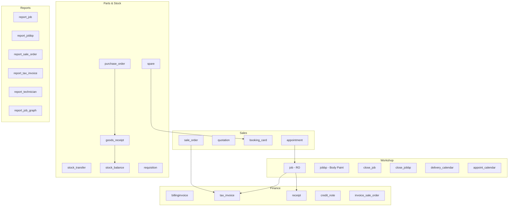

# ADAM SPS — System Overview

**Updated:** 2026-05-31
**Indexed via:** codegraph (4,170 files · 19,222 nodes · 67,073 edges)

---

## What is ADAM SPS?

Automotive Dealer Management System (DMS) ของ ช.เอราวัณ ออโต้ กรุ๊ป
- จัดการ Workshop (ศูนย์ซ่อม), Sales, Parts, Finance ครบวงจร
- ใช้ภายใน — ไม่มี public API, ทุกอย่างเป็น server-side PHP render

---

## Tech Stack

| Layer | Technology |
|-------|-----------|
| Framework | Laravel 3 (Legacy — pre-Composer era) |
| Language | PHP 5.6 |
| Database | MySQL, charset utf8, timezone UTC+7 |
| Web Server | Apache 2 + PHP-FPM |
| Container | Docker + Docker Compose |
| Deploy | AWS ECR (ap-southeast-1) |
| PDF | MPDF library |
| Excel | PHPExcel library |
| Email | PHPMailer |
| Frontend | Bootstrap CSS + jQuery + AdminLTE v3 |

**Path:** `~/adamsps/adam/laravel/`
**Port:** 8080 (→ Apache :80)

---

## Multi-Branch Architecture

```
Company (ช.เอราวัณ)
  ├── Branch 1 — Mazda สาขา 1
  ├── Branch 2 — Mazda สาขา 2
  ├── Branch 3 — Ford สาขา
  ├── Branch 5 — Mazda สาขา 5
  └── Branch N — ...
```

- ทุก entity มี `branch_id`
- Tables บางตัว dynamic per-branch: `adam_{branch_id}_service`, `adam_{branch_id}_config`
- Tables บางตัว dynamic per-brand: `adam_mazda_spare`, `adam_ford_spare`
- **Calendar:** ใช้ พ.ศ. — convert ด้วย `year - 543`

---

## Module Map (84 Controllers)



---

## Core Tables

### Primary Entities

| Table | Prefix | Description |
|-------|--------|-------------|
| `adam_appointment` | AP{YY}{MM}{XXXX} | นัดหมายซ่อม / Workshop appointment |
| `adam_sale_order` | SO... | ใบสั่งขายอะไหล่ |
| `adam_sale_order_items` | — | Line items ของ SO |
| `adam_job` | JB... | Repair Order (RO) งานซ่อม |
| `adam_jobbp` | BP... | Body & Paint job |
| `adam_task` | TA... | Task ภายใน Job |
| `adam_task_items` | — | Line items ของ Task |
| `adam_tax_invoice` | — | ใบกำกับภาษี |
| `adam_vehicle` | — | ทะเบียนรถ |
| `adam_vehicle_owner` | — | เจ้าของรถ |

### Inventory Tables

| Table | Description |
|-------|-------------|
| `adam_{brand}_spare` | Master อะไหล่ per brand |
| `adam_stock` | ยอดคงเหลือปัจจุบัน |
| `adam_stock_card` | Transaction history |
| `adam_goods_receipt` | รับของ |
| `adam_purchase_orders` | PO |

---

## Key Patterns

### 1. Buddhist Calendar Conversion
```php
// Input: วันที่ พ.ศ. เช่น "01/01/2568"
$date = new DateTime(
    substr_replace($input, substr($input, 6) - 543, 6, 4)
);
```

### 2. Status-Based Soft Delete
- `{entity}_status = 0` → ลบแล้ว / inactive
- `{entity}_status = 1` → active
- `{entity}_draft` → timestamp ก่อน approve
- `{entity}_timestamp` → timestamp หลัง approve

### 3. Dynamic Table Names
```php
// Brand table — ขึ้นกับ branch
if ($branch_id == 1 || $branch_id == 2 || $branch_id == 5)
    $spare_table = 'adam_mazda_spare';
else if ($branch_id == 3)
    $spare_table = 'adam_ford_spare';
```

### 4. RESTful Controller Pattern
```php
class booking_card_Controller extends Base_Controller {
    public $restful = true;
    public function get_form()  { ... }  // GET /booking_card/form
    public function post_index() { ... } // POST /booking_card
    public function put_index()  { ... } // PUT /booking_card
    public function delete_index() { ... } // DELETE /booking_card
}
```

---

## Integration Status with ch-erawan-next

| Goal | Status |
|------|--------|
| ยอดจองรายวัน (appointment daily) | ❌ ยังไม่มี |
| REST API layer | ❌ ไม่มี endpoint |
| Direct MySQL query | 🔧 ทำได้ (ต้องเปิด network) |
| Thin PHP API | 🔧 ทำได้ (เพิ่ม routes) |
| Cron export → Turso | 🔧 ทำได้ (ง่ายสุด) |

→ ดูรายละเอียดใน [[02-Integration-Plan]]

---

## Related Notes
- [[01-Module-Detail]] — รายละเอียด controller + SQL ของแต่ละ module
- [[02-Integration-Plan]] — แผน integrate กับ ch-erawan-next
- [[03-Database-Schema]] — Schema diagram ER
