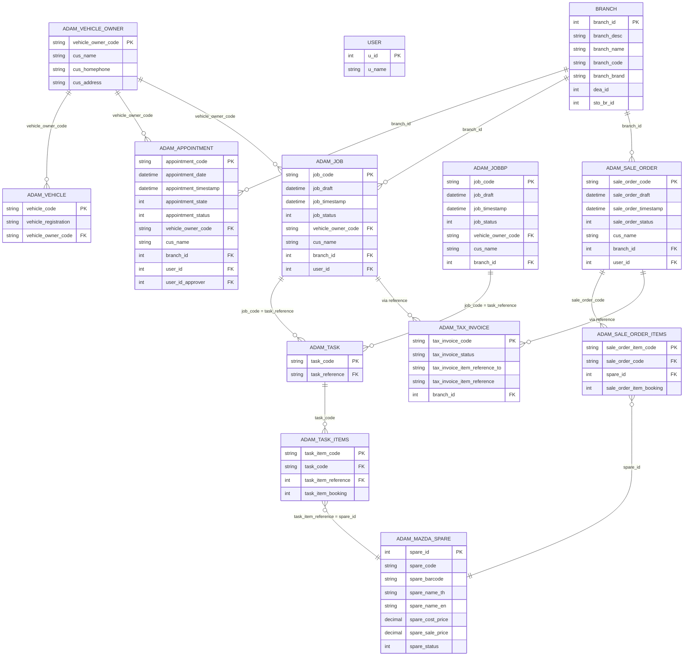
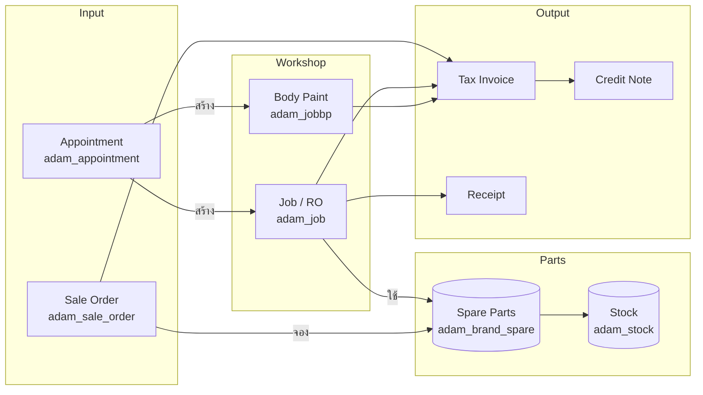

# ADAM SPS — Database Schema

**Source:** Code analysis + SQL queries from controllers
**Updated:** 2026-05-31

---

## ER Diagram — Core Entities



---

## Module Dependency Graph



---

## Document Number Formats

| Document | Format | Example |
|----------|--------|---------|
| Appointment | AP{YY}{MM}{XXXX} | AP260500001 |
| Job / RO | JB{YY}{MM}{XXXX} | JB2605001 |
| Body Paint | BP{YY}{MM}{XXXX} | BP2605001 |
| Sale Order | SO... | SO2605001 |
| Task | TA{YY}{MM}{XXXX} | TA2605001 |

**Note:** YY = 2 หลักสุดท้ายของปี CE (ไม่ใช่ พ.ศ.)

---

## Tables ที่ Dynamic (per branch / per brand)

### Per Brand
| Pattern | ตัวอย่าง |
|---------|---------|
| `adam_{brand}_spare` | adam_mazda_spare, adam_ford_spare |

### Per Branch  
| Pattern | ตัวอย่าง |
|---------|---------|
| `adam_{branch_id}_service` | adam_1_service |
| `adam_{branch_id}_config` | adam_1_config |
| `adam_{branch_id}_job_set` | adam_1_job_set |

### Branch → Brand Mapping (hardcoded)
```
branch_id 1, 2, 5 → adam_mazda_spare
branch_id 3       → adam_ford_spare
```

---

## Status Codes

### Appointment State
| State | Meaning |
|-------|---------|
| 1 | สร้างใหม่ |
| 6 | แก้ไข / re-appointment |
| 7 | อนุมัติแล้ว |

### Generic Status
| Value | Meaning |
|-------|---------|
| 0 | ลบแล้ว / Inactive |
| 1 | Active |

---

## Related Notes
- [[00-Overview]] — ภาพรวม
- [[01-Module-Detail]] — รายละเอียด controllers
- [[02-Integration-Plan]] — แผน integrate
